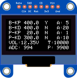

# pid-invertedpendulum

## Method of Operation
There are four buttons on the control unit - two on the top (labelled RESET, USER), and two on the front (labelled X, M). 
Input functionality is defined in the Key() method of BALANCE\CONTROL\control.c as follows:
 - Press RESET button : Resets to default state
 - Single Click USER button : Start / Stop balancing
 - ( Double Click USER : Reverse Direction Balance according to code, but I can't see how you'd be able to do this)
 - Long Press X : Toggle Auto-Balance Mode.

When Auto-Balance is selected, the Blue LED L2 will light up. 
Before continuing, **ensure the trolley is located all the way to the left-hand side** (i.e the encoder value P is shown close to 10000).
Starting balancing in this mode will swing the pendulum back and forward until it reaches a point when:
 - the position is not close to the edge
 - the angle is near the balance point
 - the angular velocity is close to 0
When this position is achieved three times consecutively, the code sets PID parameters based on that as the target point. 
 
The pendulum will _stop_ attempting to balance whenever any of the conditions in the Turn_Off() method of BALANCE\CONTROL\control.c method are met:
 - Voltage falls below 700
 - Flag_Stop = 1
 - Angle_Balance differs from balance point by > 500

## Display
OLED readout shows values as follows:
 - B-KP, B-KD: Balance KP, KD PID control values
 - P-KP, P-KD: Position KP, KD PID control values
 - A: Amplitudes (1-4)
 - VOL: Voltage
 - T: Target Position
 - P: Actual Linear Encoder Reading (5,850 at extreme right, 10,000 at extreme left)
 - ADC: Rotary Encoder Reading  (0 when pointing left, increasing anti-clockwise to 4096 after full rotation. So 1024=down, 2048=right, 3072=up).

## Code Structure
 - The main() program loop is contained in USER\Minibalance.c, but you'll find it quite sparse - it begins by initialising all the hardware and then enters an infinite while() loop whose only function appears to be to update the display.
 - The reason is that the control loop is actually contained in the TIM1_UP_IRQHandler() function defined in BALANCE\CONTROL\control.c, which is an interrupt service routine called every 5ms.
 - Some input functions are defined in HARDWARE\exti\EXTI15_10_IRQHandler
