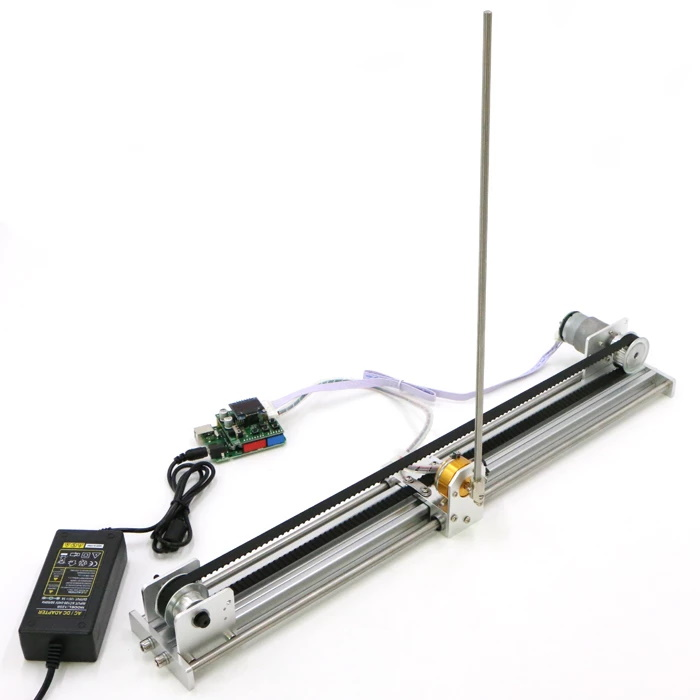
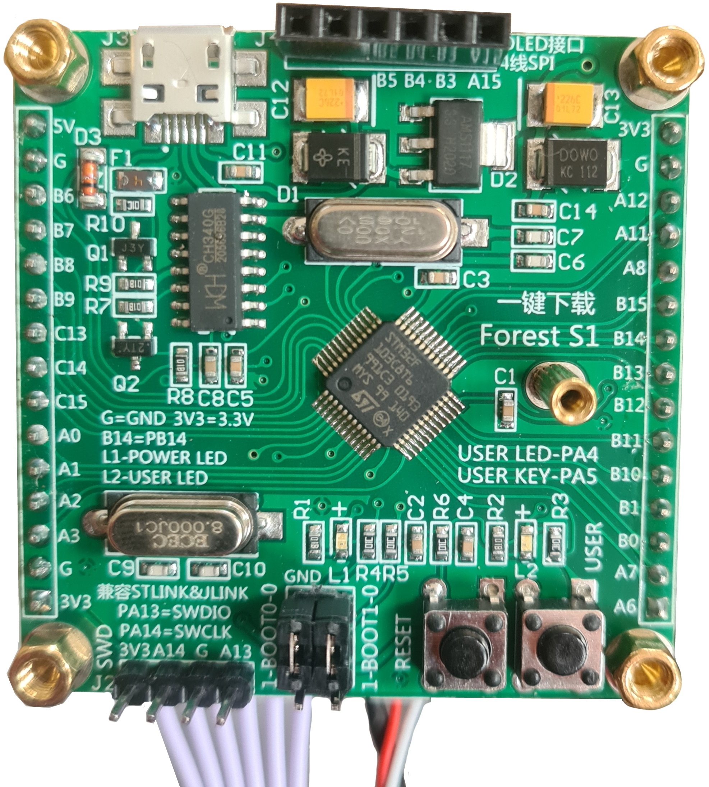
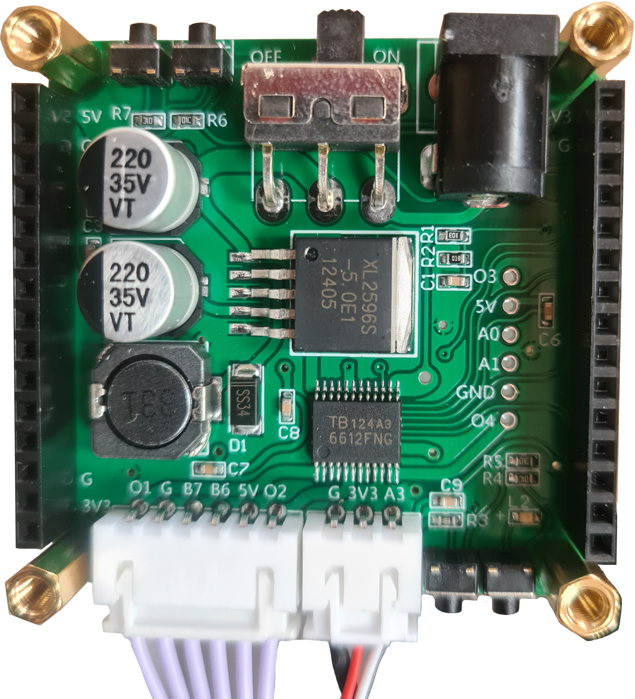
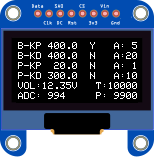

# pid-invertedpendulum

This repository contains code to accompany an "Inverted Pendulum" based on an STM32F103C8 controller I bought on AliExpress.

- :heavy_check_mark: The product was described as being provided with source code
- :x: It was not
- :heavy_check_mark: After contacting the seller a few times, they did email me a download
- :x: The download was a zip archive consisting of a load of various projects, unsorted files, and various directories, in Chinese
- :heavy_check_mark: I was able to work out which sections of the download related to the STM32 source code running on the device
- :x: I'm not that familiar with STM32 project structure
- :heavy_check_mark: The code was commented
- :x: The comments were in Chinese
- :heavy_check_mark: Google Translate exists! And I know some Chinese programmers
- :x: Even when translated, the comments weren't always accurate  

So, I basically ending up having to reverse-engineer the source code from a combination of how the product actually behaved, what the product description said it should do, what the translated Chinese comments said it did, and what the code actually did. And this repository is the result.

## Hardware
The same pendulum (and other similar PID control robots) is available from various sellers: I purchased from "HansaRobot" but the packaging was labelled as "Wheeltec", while the source code was commented as "MiniBalance". I'm not sure if these are all the same company, whether they are distributors, or clones of each other, but I'm fairly sure the hardware is identical and looks like this.

| Controller Top Layer | Controller Bottom Layer |
| --- | --- |
|  |  |

The components used are:
 - WDD35D4-5K Angular Encoder

## Calibration
Before use, the system should be calibrated as follows:
 1. Ensure the pendulum is stationary and hanging vertically downward
 2. Loosen the top screw connecting the pendulum to the angular encoder 
 3. Twist the central knob (located in the middle of the three screws) to turn the encoder until the ADC value reported on the OLED screen is between 1010 and 1030 (ideal value is 1024)
 4. Tighten the topmost screw to secure the pendulum to the encoder again

## Method of Operation
There are six buttons on the control unit - two on the top (labelled RESET, USER), two on the front (labelled X, M), and two on the back (labelled +/-), with functions as follows:
 - Press RESET button : Resets to default state
 - Single Click USER button : Start / Stop balancing
 - ( Double Click USER : Reverse Direction Balance according to code, but I can't see how you'd be able to do this)
 - Long Press X : Toggle Auto-Balance Mode
 - Press M : Cycle between selected PID parameter (indicated by Y on the OLED screen)
 - Long Press M : Bring up help text
 - +/- : Increase/decrease selected PID parameter by the corresponding A value

When Auto-Balance is selected, the Blue LED L2 will light up. 
Before continuing, **ensure the trolley is located all the way to the left-hand side** (i.e the encoder value P is shown close to 10000).
Starting balancing in this mode will swing the pendulum back and forward until it reaches a point when:
 - the position is not close to the edge
 - the angle is near the balance point
 - the angular velocity is close to 0
When this position is achieved three times consecutively, the code sets PID parameters based on that as the target point. 
 
The pendulum will _stop_ attempting to balance whenever any of the conditions in the Turn_Off() method of BALANCE\CONTROL\control.c method are met:
 - Voltage falls below 700
 - Flag_Stop = 1
 - Angle_Balance differs from balance point by > 500

## Display
OLED readout shows values as follows:
 - B-KP, B-KD: Balance KP, KD PID control values
 - P-KP, P-KD: Position KP, KD PID control values
 - A: Amplitudes, i.e. the amount by which the corresponding PID parameter will be adjusted each time +/- is pressed
 - VOL: Voltage
 - T: Target Position
 - P: Actual Linear Encoder Reading (5,850 at extreme right, 10,000 at extreme left)
 - ADC: Rotary Encoder Reading  (0 when pointing left, increasing anti-clockwise to 4096 after full rotation. So 1024=down, 2048=right, 3072=up)
 - Note that the selected PID parameter that will be edited by the +/- buttons is indicated by a Y, other parameters have an N

## Modifying the Software
While the above describes the operation of the pendulum as supplied, the main attraction for me was the fact that the source code of the controller could be reprogrammed. It uses an STM32F103C8 board based on an ARM processor, somewhat similar to an Arduino/ESP, except designed more for industrial control. 

### Using Keil
The source code comes supplied as a Keil project, so to compile and upload the supplied code to the board, you will need:
- The [Keil MDK and uVision IDE](https://www.keil.com/demo/eval/arm.htm) - you will need to register with an email address to access the download (current v5.36, 912Mb)
- [ST-Link](https://www.ebay.co.uk/itm/313809775705) - a USB dongle that acts as a debugger and uploader to the STM32 board
- The [ST-Link Driver](https://www.st.com/content/st_com/en/products/development-tools/software-development-tools/stm32-software-development-tools/stm32-utilities/stsw-link009.html#get-software) for the above (current v.2.0.2, 5Mb)

### Using STMCube
Keil has a limitation of 32kB in the free version. If you want to adapt the supplied source code or create your own STM32 projects without this restriction, you may prefer to use an alternative IDE instead.
- [STMCube32IDE](https://www.st.com/en/development-tools/stm32cubeide.html) is the completely free, "official" IDE from ST. It has all the same functionality as Keil, but uses a slightly different project structure and settings, so you can't just directly port the Keil project across (I tried but have been unsuccessful so far).
- STMCube32IDE has an inbuilt option to automatically upload to the STM32 board after compilation but, for some reason, it wouldn't work for me. So after compiling, I manually uploaded the .hex file using [STMCube32Programmer](https://www.st.com/en/development-tools/stm32cubeprog.html) instead.
- You may also want to download [STM32CubeMx](https://www.st.com/en/development-tools/stm32cubemx.html#overview) which is a sort of wizard/template configuration tool. You tell it the particular STM32 board you're targetting and the peripherals you want to use, and it will create a basic template project that you can load in uVision, and already has the necessary boilerplate configuration code. Again, you need to register with an email address to access the download link (current v6.4, 345Mb)

A few additional notes on using STMCube:
- We need to be able to reference the .h header files from the .c source code files (i.e so that the lines #include "mylibrary.h" can find mylibrary.h). To do that, right click on folders in the Project Explorer and select _Add/Remove Include Paths_ for any folder that contains an .h file
- We also need to tell the linker where to find the compiled source code files. To do *that*, go
_Project -> Properties -> C/C++ General -> Paths and Symbols -> Source Location_ to add any folders containing source files Apply and Close (note that you do not need to go into child folders - top level folder is sufficient).
- It seems that a lot of the source code makes use of "non-standard" datatype aliases. i.e. u8, u16 instead of uint8_t and unit16_t. I do see typedefs for them in one of the include files, but that's one of the includes that's giving me errors..... I'm not sure what value they have compared to using C standard types - is that a Keil thing perhaps?
- To compile the .hex file that can be uploaded to the board with STMVube32Programmer, go _Project -> Properties -> C/C++ Build -> Settings -> MCU Post Build Outputs_ Check "Convert to Intel Hex file"

## Code Structure
 - The main() program loop is contained in USER\Minibalance.c, but you'll find it quite sparse - it begins by initialising all the hardware and then enters an infinite while() loop whose only function appears to be to update the display.
 - The reason is that the control loop is actually contained in the TIM1_UP_IRQHandler() function defined in BALANCE\CONTROL\control.c, which is an interrupt service routine called every 5ms.
 - Input functionality is defined in the Key() method of BALANCE\CONTROL\control.c
 - Some additional input functions are defined in the EXTI15_10_IRQHandler() method contained in HARDWARE\EXTI\exti.c 
 - OLED display is defined in BALANCE\show\show.c
